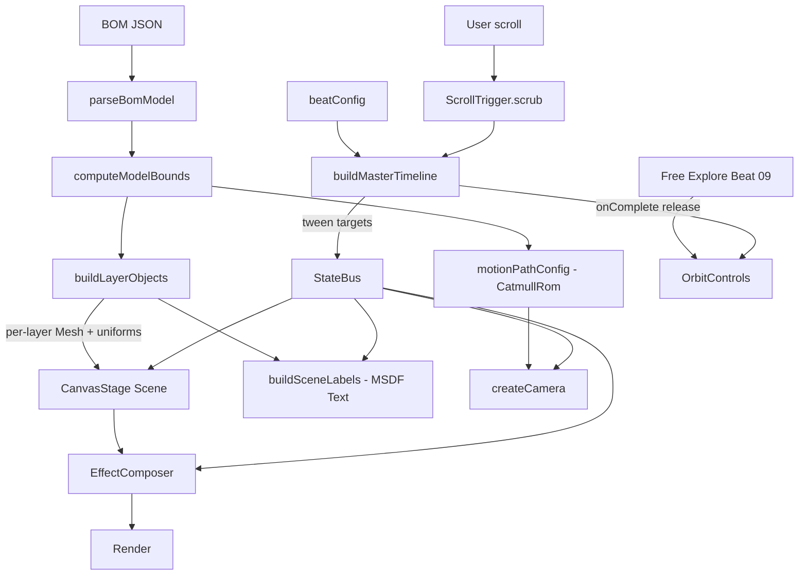
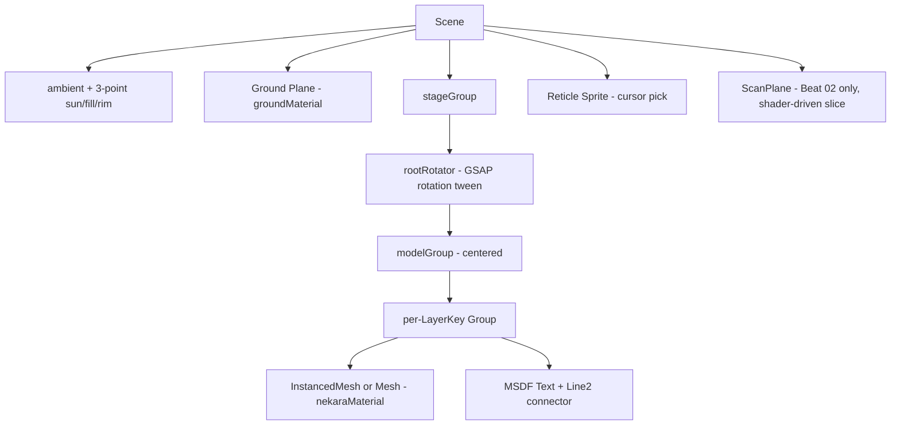

# Design Document: svelte4-3d-presentation

> Codename: **NEKARA — Architectural Tomograph**
> Output app folder: `d:\projects\sibambo-bom-engine\svelte4`
> Source data: `Model_SBMBOOST_bom_visual_nonPretty-print.json` (same BOM JSON used by svelte1–3)

---

## Overview

NEKARA is a forensic-instrument 3D presentation for the SBM BOOST BOM model that runs as one pinned WebGL canvas driven by a single GSAP master timeline scrubbed by `ScrollTrigger`. It diverges from the sibling apps (svelte1 editorial paper, svelte2 neobrutal board, svelte3 cinematic glass) by replacing per-section CSS choreography with a unified timeline that owns every uniform, camera position, and post-processing weight. The building exists as three blendable visual states (Schematic line drawing, Cryo frosted volume, Mass clay) interpolated across nine survey beats, ending in a free-orbit release. Sections 1–13 detail the concept, comparative analysis, architecture, components, data models, error handling, testing strategy, and correctness properties.

## 1. Concept Pitch

NEKARA is a **forensic tomograph** for buildings. It treats the BOM JSON not as something to "show" but as something to **scan, autopsy, and reconstruct on screen** in front of the viewer. The page is one fixed WebGL canvas pinned for the entire scroll. A single GSAP master timeline (`tl`) is welded to the scrollbar via `ScrollTrigger.scrub`. Every visual — camera trajectory along a 3D MotionPath, layer dissolve, shader uniform, post-processing weight, DOM overlay — is a tween on that timeline. There are no per-section CSS scenes, no manual lerp loops, no static dashboard.

The building exists in three **blendable states** at all times:

1. **SCHEMATIC** — pure line drawing (thick screen-space outlines, blueprint grid, no fill).
2. **CRYO** — frosted volumetric ghost (Fresnel rim, dithered alpha, bluish ISO transmission).
3. **MASS** — clay render (matcap-like soft shading, contact shadow, warm fill).

The narrative is the **dial between these three states** plus the camera path. Tomograph survey beats:

```
01 INDEX        SCHEMATIC=1.0  CRYO=0.0  MASS=0.0   camera: orbit-far
02 SCAN         SCHEMATIC=0.6  CRYO=0.4  MASS=0.0   camera: helix-down
03 CRYO LOCK    SCHEMATIC=0.2  CRYO=1.0  MASS=0.0   camera: dolly-in
04 ATTRIBUTION  SCHEMATIC=0.0  CRYO=0.7  MASS=0.3   camera: orbit-mid (per-layer label sweep)
05 STRATA       SCHEMATIC=0.0  CRYO=0.4  MASS=0.6   camera: cross-section slide
06 CAST         SCHEMATIC=0.0  CRYO=0.0  MASS=1.0   camera: low-angle hero
07 ASSEMBLY     SCHEMATIC=0.3  CRYO=0.3  MASS=0.7   camera: explode-collapse
08 ARCHIVE      SCHEMATIC=1.0  CRYO=0.0  MASS=0.0   camera: top-down plate
09 RELEASE      free-orbit, GSAP tweens unlocked, user takes control
```

What makes this *totally different* from the siblings:

- svelte1 stacks `100vh` story sections with manual `requestAnimationFrame` parallax + lerp — NEKARA replaces all of it with a single GSAP master timeline that owns every numeric value on the page.
- svelte2 is a fixed neobrutal dashboard with click-driven scene switching — NEKARA is scroll-only, no buttons drive scenes; the rail is just a timeline scrubber.
- svelte3 morphs a glass card across viewport — NEKARA does not even have a card. Headlines render directly into the WebGL canvas as MSDF text bound to 3D anchor points, and the only chrome is a thin GSAP-driven scanline HUD.
- svelte1–3 use static `MeshStandardMaterial` and DOM labels — NEKARA replaces materials with a single custom `ShaderMaterial` whose uniforms are tweened, and ships an `EffectComposer` post-processing chain (SSAO + custom outline + bloom + grain + vignette).

---

## 2. Comparative Analysis

| Axis                       | svelte1 (Editorial Paper)             | svelte2 (Neobrutal Board)              | svelte3 (Cinematic Glass)             | **svelte4 NEKARA**                              |
|----------------------------|---------------------------------------|----------------------------------------|---------------------------------------|-------------------------------------------------|
| Layout root                | `100vh` stacked story sections        | Fixed dashboard panels                 | Pinned canvas + morphing glass card   | Pinned canvas + WebGL HUD, no DOM scenes        |
| Animation engine           | `requestAnimationFrame` + manual lerp | none (CSS hover only)                  | rAF + manual lerp + custom morph math | **GSAP master timeline + ScrollTrigger.scrub**  |
| Scroll → state             | section center test                   | none                                   | section centers + bezier card morph   | One timeline, scrub-bound to entire page        |
| Camera                     | per-scene preset, lerped              | per-scene preset, click-switched       | per-scene preset, lerped              | **MotionPath bezier curve**, GSAP tween param   |
| Material                   | `MeshStandardMaterial` per state      | white clay `MeshStandardMaterial`      | clay `MeshStandardMaterial`           | **single custom `ShaderMaterial`** (3 states)   |
| Edges                      | `EdgesGeometry` + `LineSegments`      | same                                   | same                                  | **screen-space outline pass** (depth+normal)    |
| Post-processing            | none                                  | none                                   | none                                  | EffectComposer: SSAO, Outline, Bloom, Grain, Vignette |
| Layer animation            | hard switch + lerp position           | hard switch                            | scroll-driven explode 0/1             | per-layer dissolve uniform + GSAP stagger       |
| Labels                     | DOM `.model-label` reproject every frame | DOM, fixed                          | DOM, fixed                            | MSDF `Text` mesh in scene + connector lines     |
| Theme                      | light/dark CSS tokens                 | always light neobrutal                 | day/night cross-fade                  | one mood (cyan-on-graphite), state-driven palette via uniforms |
| Typography                 | serif + mono                          | bold sans + mono                       | sans + serif glass                    | mono + condensed display, all on canvas         |
| Free explore               | toggle button → `OrbitControls`       | toggle button → `OrbitControls`        | toggle button → `OrbitControls`       | last beat unlocks GSAP→Orbit handoff cleanly    |
| BOM JSON surfacing         | names + layer color only              | names + macro counts                   | names + per-section copy               | doc metadata, area_m2, surface_type, name-derived dimension tags, live integrating counters |
| Identity                   | architecture magazine                 | risograph poster                       | film trailer                          | medical/forensic instrument                     |

---

## Architecture

See Section 3 (High-Level Architecture) below for the full module map, scene graph, data flow Mermaid diagram, and GSAP timeline structure. See Section 4 (Low-Level Design) for component-level interfaces, shader code, algorithmic pseudocode with preconditions/postconditions/loop invariants, and example usage. See Section 6 (Tech Choices) for stack rationale.

## 3. High-Level Architecture

### 3.1 Module Map

```
svelte4/
├── index.html
├── package.json                    # bun, vite, svelte 5, three ^0.171, gsap ^3.12
├── vite.config.ts
├── public/
│   └── Model_SBMBOOST_bom_visual_nonPretty-print.json   # copy of root JSON
└── src/
    ├── main.ts                     # mount NekaraApp
    ├── NekaraApp.svelte            # shell: loader, HUD overlay, canvas host, ScrollTrigger
    ├── components/
    │   ├── CanvasStage.svelte      # mounts Three renderer + composer + scene
    │   ├── ScanlineHUD.svelte      # WebGL-aligned overlay (timeline rail, beat ticks)
    │   ├── CursorReticle.svelte    # custom cursor reticle, GSAP-driven
    │   ├── DataPanel.svelte        # NEW: HUD DOM panel, content-swapped per beat
    │   └── LoaderPanel.svelte      # initial JSON path + upload
    ├── three/
    │   ├── createRenderer.ts       # WebGLRenderer + composer
    │   ├── createScene.ts          # scene + lights + ground + ambient occluders
    │   ├── buildLayerObjects.ts    # parsed model → InstancedMesh / Mesh per layer
    │   ├── camera/
    │   │   ├── createCamera.ts
    │   │   └── motionPath.ts       # CatmullRomCurve3 + sampled lookAt frames
    │   ├── materials/
    │   │   ├── nekaraMaterial.ts   # custom ShaderMaterial (Schematic/Cryo/Mass blend)
    │   │   ├── nekaraMaterial.vert
    │   │   ├── nekaraMaterial.frag
    │   │   └── groundMaterial.ts
    │   ├── postprocessing/
    │   │   ├── createComposer.ts
    │   │   ├── outlinePass.ts      # depth+normal edge detection
    │   │   ├── outlinePass.frag
    │   │   ├── grainPass.ts
    │   │   ├── grainPass.frag
    │   │   └── vignettePass.ts
    │   └── labels/
    │       ├── buildSceneLabels.ts # MSDF text meshes
    │       └── connectorLines.ts   # `Line2` (LineMaterial) leader lines
    ├── animation/
    │   ├── gsapSetup.ts            # registerPlugin(ScrollTrigger, MotionPathPlugin, Observer, Flip)
    │   ├── timeline.ts             # buildMasterTimeline()
    │   ├── beats.ts                # 9 beat definitions (states, camera t, dissolve schedule)
    │   ├── dissolveStagger.ts      # per-layer dissolve bands + GSAP stagger config
    │   └── reveal.ts               # initial intro tween, exit handoff to OrbitControls
    ├── data/
    │   ├── beatConfig.ts           # 9 NEKARA beats
    │   ├── motionPathConfig.ts     # control points relative to bounds
    │   ├── layerOrder.ts           # canonical dissolve order
    │   └── palette.ts              # cyan/graphite/amber tomograph palette
    ├── lib/                        # ported from svelte1 with same APIs
    │   ├── parseBomModel.ts
    │   ├── computeModelBounds.ts
    │   ├── buildGeometryFromFace.ts
    │   ├── detectLayerGroup.ts
    │   ├── extractBomInfo.ts       # NEW: doc metadata, layer/macro stats, name tags
    │   ├── format.ts
    │   └── sampleNoise.ts          # blue-noise texture for dissolve threshold
    ├── types/
    │   ├── bom.ts                  # reused (note: materials field treated as optional)
    │   ├── model.ts                # reused
    │   ├── bomInfo.ts              # NEW: DocumentMetadata, LayerStats, MacroStats, NameTags
    │   ├── beat.ts                 # NEKARA-specific Beat type
    │   └── timeline.ts             # Tween targets type
    └── styles/
        └── nekara.css              # only HUD, loader, cursor; no scene CSS
```

### 3.2 Data Flow



### 3.3 Scene Graph



### 3.4 GSAP Timeline Structure

```
masterTimeline (duration ≈ 9.0, ScrollTrigger.scrub: 1.2)
├── label "beat-01" @ 0.0   intro fade-in, schematic=1
├── label "beat-02" @ 1.0   scan pass: ScanPlane y descends, dissolve stagger reveals layers
├── label "beat-03" @ 2.0   cryoLock=1, schematic→0.2, camera dollies forward
├── label "beat-04" @ 3.0   per-layer attribution: stagger of label-mesh fadeIns + connector draw
├── label "beat-05" @ 4.0   strata: macroGroup explodeOffset.y tween + cross-section clip
├── label "beat-06" @ 5.0   mass=1, low-angle hero, bloom up, grain down
├── label "beat-07" @ 6.0   assembly: explodeOffset → 0, schematic spike at midpoint
├── label "beat-08" @ 7.0   archive: orthographic transition, schematic=1, camera top-down
└── label "beat-09" @ 8.0   release: composer to soft mode, OrbitControls.enabled=true

Plugins: ScrollTrigger, MotionPathPlugin, Observer, Flip
Eases: CustomEase("nekara", "M0,0 C0.18,0 0.04,1 1,1") + power3.inOut
```

---

## 4. Low-Level Design

### 4.1 Core Types

```ts
// src/types/beat.ts
export type BeatId =
  | "index" | "scan" | "cryoLock" | "attribution"
  | "strata" | "cast" | "assembly" | "archive" | "release";

export type StateMix = { schematic: number; cryo: number; mass: number };

export type DataPanelKind =
  | "metadata"          // doc-level: schema_version/export_level/exported_at + counts
  | "scanCounters"      // live integrating area + face count as scan plane descends
  | "layerCard"         // per-layer focused card (active layer = nearest to camera)
  | "macroSummary"      // 6 macro group totals
  | "specimenCard"      // global stats (bounds size, total area, total components)
  | "componentBrowser"  // beat 09 free-orbit, click-to-inspect ComponentMeta panel
  | null;

export interface Beat {
  id: BeatId;
  index: number;          // 0..8, also timeline label time
  state: StateMix;        // weights at this beat
  cameraT: number;        // 0..1 along MotionPath
  cameraLookAhead: number; // tangent offset for lookAt sample
  fov: number;            // tweenable
  bloomStrength: number;
  grainAmount: number;
  vignetteAmount: number;
  ssaoIntensity: number;
  outlineThickness: number;
  schemaGridOpacity: number;
  scanPlaneY: number | null;     // null = ScanPlane hidden
  explodeAxis: "y" | "radial";
  explodeAmount: number;         // 0..1 multiplier for macro.explodeOffset
  layerDissolveStaggerMs: number; // 0 = simultaneous
  ortho: boolean;                // true → swap to orthographic at this beat
  headline: string;
  body: string;
  marker: string;                // 3-letter code shown on HUD
  dataPanel: DataPanelKind;      // which DataPanel content this beat surfaces
}
```

```ts
// src/types/timeline.ts
export interface NekaraTweenTargets {
  state: StateMix;                 // mutable, GSAP tweens its fields
  camera: { t: number; fov: number; lookAhead: number; orthoMix: number };
  post: {
    bloom: number; grain: number; vignette: number;
    ssao: number; outline: number; gridOpacity: number;
  };
  scan: { y: number; visible: number };
  layers: Record<string, { dissolve: number; explode: number }>;
}
```

**Preconditions** (apply across module):
- BOM JSON parsed exactly once per file load.
- `bounds.fitRadius > 0` and `bounds.center` finite before any timeline build.
- `nekaraMaterial` instances share a single uniform block reference (avoid drift).

**Postconditions**:
- Every numeric uniform in the scene is the result of a GSAP tween of `NekaraTweenTargets`. No `requestAnimationFrame` outside the renderer loop and the scrubber.

### 4.2 Layer Build (replaces `LayerLegend`/`SceneFrame` mass)

```ts
// src/three/buildLayerObjects.ts
import { Group, Mesh, BufferGeometry } from "three";
import { mergeGeometries } from "three/examples/jsm/utils/BufferGeometryUtils.js";
import { createNekaraMaterial } from "./materials/nekaraMaterial";
import type { ParsedModel, LayerKey } from "../types/model";
import type { NekaraTweenTargets } from "../types/timeline";

export interface LayerHandle {
  key: LayerKey;
  group: Group;
  mesh: Mesh;
  material: ReturnType<typeof createNekaraMaterial>;
  homePosition: [number, number, number];
  explodeVector: [number, number, number];
  dissolveBand: number;   // 0..1 phase offset for stagger
}

export function buildLayerObjects(
  model: ParsedModel,
  targets: NekaraTweenTargets
): LayerHandle[];
```

**Preconditions**:
- `model.layers` non-empty.
- Each `layer.meshes[i].geometry` has finite vertex positions.

**Postconditions**:
- One `LayerHandle` per non-empty layer.
- All handles share the same `nekaraMaterial` uniform pool referenced by `targets`.
- `targets.layers[key]` exists for every emitted handle.

### 4.3 Custom Shader (NekaraMaterial)

Three states blend continuously. A single fragment shader, three shading branches mixed by weights from `targets.state`. Dissolve handled by blue-noise threshold.

**Vertex (sketch)**:

```glsl
// nekaraMaterial.vert
uniform float uExplodeAmount;
uniform vec3  uExplodeVector;
uniform float uTime;
attribute float aDissolveBand;  // 0..1 per-vertex (pre-baked)

varying vec3 vWorldNormal;
varying vec3 vWorldPos;
varying float vDissolveBand;
varying float vViewDepth;

void main() {
  vec3 displaced = position + uExplodeVector * uExplodeAmount;
  vec4 worldPos  = modelMatrix * vec4(displaced, 1.0);
  vec4 viewPos   = viewMatrix  * worldPos;
  vWorldNormal   = normalize(mat3(modelMatrix) * normal);
  vWorldPos      = worldPos.xyz;
  vDissolveBand  = aDissolveBand;
  vViewDepth     = -viewPos.z;
  gl_Position    = projectionMatrix * viewPos;
}
```

**Fragment (sketch)**:

```glsl
// nekaraMaterial.frag
uniform sampler2D uBlueNoise;
uniform float uDissolve;          // 0=hidden, 1=fully visible
uniform float uSchematic;         // weight 0..1
uniform float uCryo;              // weight 0..1
uniform float uMass;              // weight 0..1
uniform vec3  uPaletteIce;        // cyan
uniform vec3  uPaletteGraphite;   // near-black
uniform vec3  uPaletteAmber;      // accent
uniform vec3  uLightDir;
uniform float uTime;
uniform float uGridFreq;
uniform float uGridOpacity;

varying vec3  vWorldNormal;
varying vec3  vWorldPos;
varying float vDissolveBand;
varying float vViewDepth;

float hash21(vec2 p) { return fract(sin(dot(p, vec2(127.1, 311.7))) * 43758.5453); }

void main() {
  // 1. Dissolve gate per fragment, threshold by per-vertex band + global progress
  float band = vDissolveBand;
  float threshold = clamp((band - (1.0 - uDissolve)) * 4.0, 0.0, 1.0);
  float noise = texture2D(uBlueNoise, gl_FragCoord.xy / 256.0).r;
  if (threshold < noise * 0.92 + 0.04) discard;

  // 2. Mass shading - matcap-ish wrap diffuse + warm rim
  float ndl = clamp(dot(vWorldNormal, normalize(uLightDir)) * 0.5 + 0.5, 0.0, 1.0);
  vec3 massCol = mix(uPaletteGraphite, vec3(0.92, 0.88, 0.8), pow(ndl, 1.4));
  massCol += pow(1.0 - ndl, 3.0) * uPaletteAmber * 0.32;

  // 3. Cryo shading - inverse fresnel, cyan, dithered
  float fres = pow(1.0 - max(dot(normalize(-vWorldPos), vWorldNormal), 0.0), 2.2);
  vec3 cryoCol = mix(uPaletteGraphite * 0.4, uPaletteIce, fres);
  cryoCol *= 0.7 + 0.3 * step(noise, 0.6); // dither

  // 4. Schematic - blueprint grid + flat ink
  vec2 g = vWorldPos.xz * uGridFreq;
  float grid = max(step(0.96, fract(g.x)), step(0.96, fract(g.y)));
  vec3 schemaCol = mix(uPaletteGraphite * 0.15, uPaletteIce, grid * uGridOpacity);
  schemaCol += vec3(0.04) * (1.0 - ndl);

  // 5. Mix by global state weights (normalized in JS each tween)
  vec3 col = uMass * massCol + uCryo * cryoCol + uSchematic * schemaCol;

  // 6. Depth-based desaturation for far parts
  float farFade = clamp(1.0 - vViewDepth * 0.012, 0.4, 1.0);
  col *= farFade;

  gl_FragColor = vec4(col, 1.0);
}
```

**Preconditions for shader uniforms**:
- `uSchematic + uCryo + uMass` ∈ [0.5, 1.5] (renormalized in JS but graceful at any nonneg sum).
- `uDissolve` ∈ [0, 1].
- `uBlueNoise` is a 256×256 R-channel blue-noise texture.

**Postconditions**:
- For `uDissolve = 1`, every fragment with `vDissolveBand ≥ 0` passes the discard test.
- For `uDissolve = 0`, every fragment is discarded (layer fully invisible).
- For each fragment, `gl_FragColor.rgb` lies in [0,1]³ after `farFade` clamp.

### 4.4 Outline Post-Pass

```glsl
// outlinePass.frag
uniform sampler2D tDiffuse;
uniform sampler2D tDepth;
uniform sampler2D tNormal;
uniform vec2 uResolution;
uniform float uThickness;
uniform float uDepthEdge;
uniform float uNormalEdge;
uniform vec3 uOutlineColor;
varying vec2 vUv;

float sampleDepth(vec2 uv) { return texture2D(tDepth, uv).r; }

void main() {
  vec2 px = uThickness / uResolution;
  float d0 = sampleDepth(vUv);
  float dx = sampleDepth(vUv + vec2(px.x, 0.0));
  float dy = sampleDepth(vUv + vec2(0.0, px.y));
  float depthEdge = step(uDepthEdge, abs(d0 - dx) + abs(d0 - dy));

  vec3 n0 = texture2D(tNormal, vUv).xyz * 2.0 - 1.0;
  vec3 nx = texture2D(tNormal, vUv + vec2(px.x, 0.0)).xyz * 2.0 - 1.0;
  vec3 ny = texture2D(tNormal, vUv + vec2(0.0, px.y)).xyz * 2.0 - 1.0;
  float normalEdge = step(uNormalEdge, 1.0 - min(dot(n0, nx), dot(n0, ny)));

  float edge = clamp(depthEdge + normalEdge, 0.0, 1.0);
  vec3 base = texture2D(tDiffuse, vUv).rgb;
  gl_FragColor = vec4(mix(base, uOutlineColor, edge), 1.0);
}
```

Normal+depth render targets emitted by a duplicated render pass with a `MeshNormalMaterial` override and a depth-only render. Standard pattern in `three/examples/jsm/postprocessing`.

### 4.5 Camera MotionPath

```ts
// src/three/camera/motionPath.ts
import { CatmullRomCurve3, Vector3, PerspectiveCamera, OrthographicCamera } from "three";

export interface CameraRig {
  perspective: PerspectiveCamera;
  ortho: OrthographicCamera;
  curve: CatmullRomCurve3;
  sample(t: number, lookAhead: number, orthoMix: number): void;
}

/**
 * Preconditions:
 *   - controlPoints.length >= 4
 *   - bounds.fitRadius > 0
 * Postconditions:
 *   - rig.curve.closed === false
 *   - sample(t, _, _) for any t ∈ [0,1] sets perspective.position to a finite Vec3
 *   - rig.perspective.matrixWorld is up-to-date after sample() returns
 */
export function createCameraRig(
  controlPoints: Vector3[],
  bounds: { center: Vector3; fitRadius: number }
): CameraRig;
```

GSAP tweens `targets.camera.t`. The renderer loop calls `rig.sample(targets.camera.t, targets.camera.lookAhead, targets.camera.orthoMix)`.

GSAP `MotionPathPlugin` works in 2D; for 3D we sample `CatmullRomCurve3.getPointAt` ourselves. The plugin is still used for the **HUD reticle** that traces an SVG path along the bottom rail.

### 4.6 Master Timeline Construction

```ts
// src/animation/timeline.ts
import gsap from "gsap";
import { ScrollTrigger } from "gsap/ScrollTrigger";
import { MotionPathPlugin } from "gsap/MotionPathPlugin";
import { Observer } from "gsap/Observer";
import { Flip } from "gsap/Flip";
import { CustomEase } from "gsap/CustomEase";
import type { Beat } from "../types/beat";
import type { NekaraTweenTargets } from "../types/timeline";

export interface BuiltTimeline {
  tl: gsap.core.Timeline;
  scrollTrigger: ScrollTrigger;
  release(): void;       // unlock orbit, called at beat-09 onComplete
  rebuild(): void;       // for resize/layout-shift driven recalc via Flip
}

/**
 * Preconditions:
 *   - gsap.registerPlugin already executed for all required plugins
 *   - beats.length === 9 and beats are index-sorted
 *   - layers contains a target entry for every layer key
 *
 * Postconditions:
 *   - tl.duration() === beats.length - 1 (one timeline-second per beat)
 *   - tl.labels has exactly the 9 beat ids as keys
 *   - scrollTrigger.scrub > 0
 *   - At any tl.progress() === beat.index / 8, tween targets equal beat.state and beat.post within 1e-3
 *   - Loop invariant during build: after adding tween for beat i, tl.duration() === i
 */
export function buildMasterTimeline(
  beats: Beat[],
  targets: NekaraTweenTargets,
  layerKeys: string[]
): BuiltTimeline;
```

**Implementation skeleton**:

```ts
export function buildMasterTimeline(beats, targets, layerKeys) {
  gsap.registerPlugin(ScrollTrigger, MotionPathPlugin, Observer, Flip, CustomEase);
  CustomEase.create("nekara", "M0,0 C0.18,0 0.04,1 1,1");

  const tl = gsap.timeline({
    scrollTrigger: {
      trigger: "#nekara-shell",
      start: "top top",
      end: () => `+=${(beats.length - 1) * window.innerHeight * 1.4}`,
      scrub: 1.2,
      pin: "#nekara-canvas-pin",
      anticipatePin: 1,
      invalidateOnRefresh: true,
      snap: { snapTo: "labels", duration: { min: 0.2, max: 0.6 }, ease: "power2.inOut" }
    }
  });

  beats.forEach((beat, i) => {
    tl.addLabel(beat.id, i);

    // Continuous-state tween (declarative over keyframes)
    tl.to(targets.state, { ...beat.state, ease: "nekara" }, i);

    tl.to(targets.camera, {
      t: beat.cameraT,
      fov: beat.fov,
      lookAhead: beat.cameraLookAhead,
      orthoMix: beat.ortho ? 1 : 0,
      ease: "power3.inOut"
    }, i);

    tl.to(targets.post, {
      bloom: beat.bloomStrength,
      grain: beat.grainAmount,
      vignette: beat.vignetteAmount,
      ssao: beat.ssaoIntensity,
      outline: beat.outlineThickness,
      gridOpacity: beat.schemaGridOpacity,
      ease: "power2.inOut"
    }, i);

    tl.to(targets.scan, {
      y: beat.scanPlaneY ?? 0,
      visible: beat.scanPlaneY === null ? 0 : 1,
      ease: "sine.inOut"
    }, i);

    // Per-layer dissolve + explode with stagger band
    tl.to(
      layerKeys.map((k) => targets.layers[k]),
      {
        dissolve: gsap.utils.wrap([0, 1]),       // overridden by per-beat scheduler
        explode: beat.explodeAmount,
        ease: "nekara",
        stagger: { each: beat.layerDissolveStaggerMs / 1000, from: "random" }
      },
      i
    );
  });

  // Beat-09 onComplete handoff
  tl.eventCallback("onUpdate", () => {
    if (tl.progress() > 0.985 && !released) {
      released = true;
      release();
    }
  });

  return { tl, scrollTrigger: tl.scrollTrigger!, release, rebuild };
}
```

### 4.7 Beat Configuration

```ts
// src/data/beatConfig.ts
import type { Beat } from "../types/beat";

export const BEATS: Beat[] = [
  {
    id: "index", index: 0,
    state: { schematic: 1, cryo: 0, mass: 0 },
    cameraT: 0.02, cameraLookAhead: 0.05, fov: 38,
    bloomStrength: 0.3, grainAmount: 0.18, vignetteAmount: 0.45,
    ssaoIntensity: 0.0, outlineThickness: 1.4, schemaGridOpacity: 0.85,
    scanPlaneY: null, explodeAxis: "y", explodeAmount: 0,
    layerDissolveStaggerMs: 0, ortho: false,
    headline: "INDEX // 00",
    body: "Building enters as a schematic plate. Datum line, blueprint grid, no fill.",
    marker: "IDX",
    dataPanel: "metadata"
  },
  {
    id: "scan", index: 1,
    state: { schematic: 0.6, cryo: 0.4, mass: 0 },
    cameraT: 0.16, cameraLookAhead: 0.06, fov: 36,
    bloomStrength: 0.6, grainAmount: 0.22, vignetteAmount: 0.4,
    ssaoIntensity: 0.2, outlineThickness: 1.2, schemaGridOpacity: 0.5,
    scanPlaneY: 1.0, explodeAxis: "y", explodeAmount: 0,
    layerDissolveStaggerMs: 420, ortho: false,
    headline: "SCAN // 01",
    body: "Tomograph beam descends. Each layer materialises only after the beam touches it.",
    marker: "SCN",
    dataPanel: "scanCounters"
  },
  {
    id: "cryoLock", index: 2,
    state: { schematic: 0.2, cryo: 1, mass: 0 },
    cameraT: 0.3, cameraLookAhead: 0.04, fov: 32,
    bloomStrength: 0.85, grainAmount: 0.12, vignetteAmount: 0.32,
    ssaoIntensity: 0.45, outlineThickness: 0.9, schemaGridOpacity: 0.18,
    scanPlaneY: null, explodeAxis: "y", explodeAmount: 0,
    layerDissolveStaggerMs: 0, ortho: false,
    headline: "CRYO LOCK // 02",
    body: "Volume frozen. Frosted ghost reveals envelope continuity.",
    marker: "CRY",
    dataPanel: "specimenCard"
  },
  {
    id: "attribution", index: 3,
    state: { schematic: 0, cryo: 0.7, mass: 0.3 },
    cameraT: 0.45, cameraLookAhead: 0.05, fov: 30,
    bloomStrength: 0.7, grainAmount: 0.1, vignetteAmount: 0.3,
    ssaoIntensity: 0.55, outlineThickness: 0.7, schemaGridOpacity: 0,
    scanPlaneY: null, explodeAxis: "y", explodeAmount: 0,
    layerDissolveStaggerMs: 220, ortho: false,
    headline: "ATTRIBUTION // 03",
    body: "Layer names attach to anchors via leader lines, swept around the volume.",
    marker: "ATR",
    dataPanel: "layerCard"
  },
  {
    id: "strata", index: 4,
    state: { schematic: 0, cryo: 0.4, mass: 0.6 },
    cameraT: 0.58, cameraLookAhead: 0.03, fov: 28,
    bloomStrength: 0.55, grainAmount: 0.1, vignetteAmount: 0.28,
    ssaoIntensity: 0.6, outlineThickness: 0.7, schemaGridOpacity: 0,
    scanPlaneY: null, explodeAxis: "y", explodeAmount: 0.85,
    layerDissolveStaggerMs: 320, ortho: false,
    headline: "STRATA // 04",
    body: "Macro groups separate vertically. Camera slides laterally for cross-section.",
    marker: "STR",
    dataPanel: "macroSummary"
  },
  {
    id: "cast", index: 5,
    state: { schematic: 0, cryo: 0, mass: 1 },
    cameraT: 0.7, cameraLookAhead: 0.02, fov: 26,
    bloomStrength: 0.95, grainAmount: 0.08, vignetteAmount: 0.22,
    ssaoIntensity: 0.7, outlineThickness: 0.55, schemaGridOpacity: 0,
    scanPlaneY: null, explodeAxis: "y", explodeAmount: 0.2,
    layerDissolveStaggerMs: 0, ortho: false,
    headline: "CAST // 05",
    body: "Solid clay hero. Low-angle dolly. Bloom lifts highlights.",
    marker: "CST",
    dataPanel: "specimenCard"
  },
  {
    id: "assembly", index: 6,
    state: { schematic: 0.3, cryo: 0.3, mass: 0.7 },
    cameraT: 0.82, cameraLookAhead: 0.05, fov: 30,
    bloomStrength: 0.6, grainAmount: 0.12, vignetteAmount: 0.28,
    ssaoIntensity: 0.55, outlineThickness: 0.8, schemaGridOpacity: 0.25,
    scanPlaneY: null, explodeAxis: "radial", explodeAmount: 0,
    layerDissolveStaggerMs: 180, ortho: false,
    headline: "ASSEMBLY // 06",
    body: "Pieces collapse home along radial vectors. Schematic spike at midpoint.",
    marker: "ASM",
    dataPanel: "macroSummary"
  },
  {
    id: "archive", index: 7,
    state: { schematic: 1, cryo: 0, mass: 0 },
    cameraT: 0.92, cameraLookAhead: 0.0, fov: 24,
    bloomStrength: 0.25, grainAmount: 0.2, vignetteAmount: 0.45,
    ssaoIntensity: 0, outlineThickness: 1.6, schemaGridOpacity: 1,
    scanPlaneY: null, explodeAxis: "y", explodeAmount: 0,
    layerDissolveStaggerMs: 0, ortho: true,
    headline: "ARCHIVE // 07",
    body: "Top-down orthographic plate. Returns to drafted line drawing.",
    marker: "ARC",
    dataPanel: "metadata"
  },
  {
    id: "release", index: 8,
    state: { schematic: 0.2, cryo: 0.4, mass: 0.6 },
    cameraT: 0.98, cameraLookAhead: 0.04, fov: 34,
    bloomStrength: 0.5, grainAmount: 0.1, vignetteAmount: 0.25,
    ssaoIntensity: 0.5, outlineThickness: 0.75, schemaGridOpacity: 0,
    scanPlaneY: null, explodeAxis: "y", explodeAmount: 0,
    layerDissolveStaggerMs: 0, ortho: false,
    headline: "RELEASE // 08",
    body: "Instrument hands the model to the viewer. Free orbit unlocked.",
    marker: "RLS",
    dataPanel: "componentBrowser"
  }
];
```

### 4.8 Algorithmic Pseudocode

#### Master frame loop

```pascal
ALGORITHM nekaraFrame(targets, rig, scene, composer)
INPUT:  targets (mutated by GSAP), rig, scene, composer
OUTPUT: side effect — composer.render(deltaTime)

BEGIN
  ASSERT targets.state.schematic + targets.state.cryo + targets.state.mass >= 0.0

  // 1. Camera follow MotionPath
  rig.sample(targets.camera.t, targets.camera.lookAhead, targets.camera.orthoMix)

  // 2. Push global state into shared shader uniforms
  sharedUniforms.uSchematic.value     ← targets.state.schematic
  sharedUniforms.uCryo.value          ← targets.state.cryo
  sharedUniforms.uMass.value          ← targets.state.mass
  sharedUniforms.uGridOpacity.value   ← targets.post.gridOpacity
  sharedUniforms.uTime.value          ← clock.elapsed

  // 3. Push per-layer uniforms
  FOR each layerHandle IN layerHandles DO
    ASSERT targets.layers[layerHandle.key] != null
    layerHandle.material.uniforms.uDissolve.value ← targets.layers[layerHandle.key].dissolve
    layerHandle.mesh.position.set(
      layerHandle.homePosition.x + layerHandle.explodeVector.x * targets.layers[layerHandle.key].explode,
      layerHandle.homePosition.y + layerHandle.explodeVector.y * targets.layers[layerHandle.key].explode,
      layerHandle.homePosition.z + layerHandle.explodeVector.z * targets.layers[layerHandle.key].explode
    )
  END FOR

  // 4. Push post-processing uniforms
  outlinePass.uniforms.uThickness.value   ← targets.post.outline
  bloomPass.strength                       ← targets.post.bloom
  grainPass.uniforms.uAmount.value         ← targets.post.grain
  vignettePass.uniforms.uAmount.value      ← targets.post.vignette
  ssaoPass.intensity                       ← targets.post.ssao

  // 5. Scan plane
  IF targets.scan.visible > 0.01 THEN
    scanPlane.position.y     ← targets.scan.y
    scanPlane.material.opacity ← targets.scan.visible * 0.85
    scanPlane.visible        ← TRUE
  ELSE
    scanPlane.visible        ← FALSE
  END IF

  // 6. Composite render
  composer.render()

  ASSERT sharedUniforms.uSchematic.value >= 0.0
END
```

**Loop invariants**: After step 3, every layer mesh's position equals `homePosition + explodeVector * explode` for that layer's current GSAP-tweened explode value.

#### Initial reveal

```pascal
ALGORITHM initialReveal(targets, layerKeys, releaseGate)
INPUT:  targets, layerKeys, releaseGate (boolean ref)
OUTPUT: gsap timeline (intro)

BEGIN
  intro ← gsap.timeline({ defaults: { ease: "nekara" } })
  intro.set(targets.post,   { bloom: 0, grain: 0.4, vignette: 0.6, gridOpacity: 0 })
  intro.set(targets.state,  { schematic: 0, cryo: 0, mass: 0 })
  FOR each key IN layerKeys DO
    targets.layers[key].dissolve ← 0
  END FOR

  intro.to(targets.state, { schematic: 1, duration: 1.2 }, 0.0)
  intro.to(targets.post,  { gridOpacity: 0.85, vignette: 0.45, duration: 1.0 }, 0.2)
  intro.to(layerKeys.map(k => targets.layers[k]), {
    dissolve: 1, duration: 0.9, stagger: { each: 0.06, from: "start" }
  }, 0.5)

  intro.eventCallback("onComplete", () => releaseGate.value ← TRUE)
  RETURN intro
END
```

#### Beat snap on resize

```pascal
ALGORITHM rebuildOnResize(scrollTrigger, rig, composer)
BEGIN
  scrollTrigger.refresh()
  rig.perspective.aspect ← window.innerWidth / window.innerHeight
  rig.perspective.updateProjectionMatrix()
  composer.setSize(window.innerWidth, window.innerHeight)
  // Flip used to retain HUD chrome positions across reflow
  Flip.from(state, { duration: 0.3, ease: "power3.out" })
END
```

### 4.9 Example Usage (NekaraApp.svelte excerpt)

```ts
// NekaraApp.svelte <script>
import { onMount, onDestroy } from "svelte";
import { mountStage } from "./three/createScene";
import { buildLayerObjects } from "./three/buildLayerObjects";
import { createCameraRig } from "./three/camera/createCamera";
import { createComposer } from "./three/postprocessing/createComposer";
import { buildMasterTimeline } from "./animation/timeline";
import { initialReveal } from "./animation/reveal";
import { BEATS } from "./data/beatConfig";
import { parseBomModel } from "./lib/parseBomModel";

let canvasHost: HTMLDivElement;
let model: ParsedModel | null = null;
let timeline: ReturnType<typeof buildMasterTimeline> | null = null;

async function commitModel(json: BomModelJson, name: string) {
  model = parseBomModel(json, name);
  const stage = mountStage(canvasHost);
  const layers = buildLayerObjects(model, stage.targets);
  const rig = createCameraRig(buildControlPoints(model.bounds), model.bounds);
  stage.scene.add(...layers.map(l => l.group));
  const composer = createComposer(stage.renderer, stage.scene, rig.perspective);
  stage.attachComposer(composer);
  initialReveal(stage.targets, layers.map(l => l.key), { value: false }).play();
  timeline = buildMasterTimeline(BEATS, stage.targets, layers.map(l => l.key));
  stage.start(); // begins requestAnimationFrame -> nekaraFrame()
}

onDestroy(() => {
  timeline?.scrollTrigger?.kill();
  timeline?.tl?.kill();
});
```

---

## 4.10 BOM Data Layer & Information Extraction

### 4.10.1 Authoritative Source Schema (observed)

Empirical inspection of `Model_SBMBOOST_bom_visual_nonPretty-print.json` (6.1 MB, the same file consumed by svelte1–3) yields the following authoritative top-level shape for **visual exports**:

```jsonc
{
  "schema_version": "2.0",       // string, present
  "export_level":   "visual",    // string, present
  "exported_at":    "<ISO8601>", // string, present
  "entities":       [ /* 54 top-level items */ ]
  // NOTE: "materials" key is ABSENT in this visual export.
}
```

Recursive entity totals in the source file:

| Metric                          | Value     |
|---------------------------------|-----------|
| Top-level entities              | 54        |
| Recursive `Face` count          | 15370     |
| Recursive `Group` count         | 392       |
| Recursive `ComponentInstance`   | 37        |
| Max tree depth                  | 7         |
| Distinct top-level names        | 13        |
| Distinct `Face.surface_type`    | 7         |
| Distinct `Face.layer` values    | 1 (`"Layer0"`) |
| Σ `Face.area_m2`                | ≈ 3362.77 |
| `BBox` count                    | 0         |

Distinct `Face.surface_type` values observed: `wall_x_pos`, `wall_x_neg`, `wall_y_pos`, `wall_y_neg`, `floor`, `ceiling`, `roof_slope`.

**Critical implication 1 — `materials` is optional.** svelte1's `BomModelJson.materials` is typed as `Record<string, BomMaterial>`. In svelte4 the type is treated as **optional** and no code path may dereference it without a guard. NEKARA does not depend on per-face materials; identity is fully shader-driven (Schematic/Cryo/Mass blend) and the semantic load is carried by component naming + dimension tags.

**Critical implication 2 — `Face.layer` is single-valued.** Every `Face` in the source carries `layer = "Layer0"`. The field is therefore useless for layer derivation. NEKARA derives layer keys exclusively by **NAME** via the existing `detectLayerKeyFromName` helper (see `svelte1/src/lib/detectLayerGroup.ts`), with `Face.surface_type` used only as a **fallback** when the parent chain yields no name match.

### 4.10.2 Field-by-Field Extraction Matrix

| Source field                          | Carrier                | Surfacing                                                                 |
|---------------------------------------|------------------------|---------------------------------------------------------------------------|
| `schema_version`                      | document               | `DataPanel` (`metadata` kind), HUD metadata strip, beats 01 + 08          |
| `export_level`                        | document               | HUD metadata strip                                                        |
| `exported_at`                         | document               | HUD metadata strip (formatted via existing `lib/format.ts`)              |
| `entities[].name`                     | Group / ComponentInstance | `detectLayerKeyFromName` + `dimensionTagsFromName`; MSDF labels + DataPanel |
| `entities[].definition_name`          | ComponentInstance      | fallback when `name` empty (see `entityName()` in `parseBomModel`)        |
| `entities[].type`                     | all                    | `topLevelTypeHistogram`, ComponentMeta.type                               |
| `entities[].children[]`               | recursion              | `walkEntity` traversal (unchanged from svelte1)                           |
| `Face.vertices[]`                     | Face                   | `BufferGeometry` via `buildGeometryFromFace`                              |
| `Face.normal`                         | Face                   | outline pass input (depth+normal edge detection, §4.4)                    |
| `Face.area_m2`                        | Face                   | live HUD counter (beat 02), `LayerStats.totalAreaM2`, `MacroStats.totalAreaM2` |
| `Face.surface_type`                   | Face                   | fallback layer key via `resolveLayerKey`; dominant value per layer        |
| `Face.material_front`                 | Face                   | optional; never required for rendering in svelte4                         |
| `Face.layer`                          | Face                   | **ignored** for layer derivation (always `"Layer0"`)                      |
| `BBox.center` / `BBox.size`           | BBox                   | parsed for forward-compat; absent in current source (count = 0)           |

### 4.10.3 New Module: `src/lib/extractBomInfo.ts`

Pure functions, no Three.js dependency, no side effects.

```ts
// src/types/bomInfo.ts
import type { LayerKey, MacroGroupKey } from "./model";

export interface DocumentMetadata {
  schemaVersion: string;     // from json.schema_version, "" if absent
  exportLevel: string;       // from json.export_level
  exportedAt: string;        // from json.exported_at (raw ISO8601)
  exportedAtPretty: string;  // formatted by lib/format.ts
  entityCount: number;       // json.entities.length
  faceCount: number;         // recursive Face count
  groupCount: number;        // recursive Group count
  componentInstanceCount: number;
  maxDepth: number;
  totalAreaM2: number;       // Σ Face.area_m2
  hasMaterials: boolean;     // !!json.materials
}

export interface LayerStats {
  key: LayerKey;
  meshCount: number;
  totalAreaM2: number;
  dominantSurfaceType: string | null;   // mode of Face.surface_type within layer
  dominantComponentName: string | null; // most common parent ComponentInstance/Group name
}

export interface MacroStats {
  key: MacroGroupKey;
  totalAreaM2: number;
  layerCount: number;
  meshCount: number;
}

export type EntityTypeName = "Group" | "ComponentInstance" | "Face" | "BBox" | string;

export interface NameTags {
  dims: number[];               // numeric dimensions parsed from name
  code: string | null;          // bracketed shorthand like "K1", "B1"
  productCode: string | null;   // suffix like "web_159", "web_303"
}
```

```ts
// src/lib/extractBomInfo.ts
import type { BomModelJson } from "../types/bom";
import type { ParsedModel } from "../types/model";
import type {
  DocumentMetadata,
  LayerStats,
  MacroStats,
  EntityTypeName,
  NameTags
} from "../types/bomInfo";

export function extractDocumentMetadata(json: BomModelJson): DocumentMetadata;
export function summarizeLayerStats(model: ParsedModel): LayerStats[];
export function summarizeMacroStats(model: ParsedModel): MacroStats[];
export function topLevelTypeHistogram(json: BomModelJson): Record<EntityTypeName, number>;
export function dimensionTagsFromName(name: string): NameTags;
```

### 4.10.4 `dimensionTagsFromName` — name-encoded information

Top-level names in the source encode three classes of information:

- **Dimensions** — `"20x20"`, `"20x30"`, `"5x10x20"`, `"120x120"`, `"80x240"`.
- **Engineering codes** — `"(K1)"`, `"(B1)"` (bracketed), and prefix codes `"J0006"`, `"P1008"`.
- **Product codes** — trailing `"_web_159"`, `"_web_303"` slugs.

Reference fixture (the 13 distinct top-level names observed):

| Name                                                                  | dims          | code  | productCode |
|-----------------------------------------------------------------------|---------------|-------|-------------|
| `Pondasi Batu Kali`                                                   | `[]`          | null  | null        |
| `Sree`                                                                | `[]`          | null  | null        |
| `Kolom 20x20 (K1)`                                                    | `[20, 20]`    | `K1`  | null        |
| `Balok 20x30 (B1)`                                                    | `[20, 30]`    | `B1`  | null        |
| `Bata5x10x20+plester2.5+cat`                                          | `[5, 10, 20]` | null  | null        |
| `Tanah Timbun`                                                        | `[]`          | null  | null        |
| `Urugan Pasir`                                                        | `[]`          | null  | null        |
| `Cor Lantai`                                                          | `[]`          | null  | null        |
| `Keramik Lantai`                                                      | `[]`          | null  | null        |
| `Atap Spandek`                                                        | `[]`          | null  | null        |
| `J0006 - Jendela Aluminium 2 Daun 120x120_web_159`                    | `[120, 120]`  | `J0006` | `web_159` |
| `P1008 - Pintu 3D Panel Kayu 80x240_web_303`                          | `[80, 240]`   | `P1008` | `web_303` |
| `Kulkas Samsung 2 Pintu RS61R5001M9 SE (700L)_web_482`                | `[]`          | null  | `web_482`   |

#### Total ordering rule for the regex chain

The parser MUST run regexes in the following order; once a class is captured the matched substring is removed before the next class runs (left-to-right, longest-first):

1. **productCode** — `/_(?<product>web_\d+)\b/` (anchored to underscore prefix; consumes trailing `_web_NNN`).
2. **prefix code** — `/^(?<code>[A-Z]\d{4})\b/` (J0006, P1008 style).
3. **bracketed code** — `/\((?<code>[A-Z]\d+)\)/` (K1, B1 style).
4. **dimensions** — `/(?<dims>\d+(?:\.\d+)?(?:x\d+(?:\.\d+)?)+)/` matched **globally**; the **first** match wins (covers `5x10x20`, `120x120`, `80x240`).

Steps 2 and 3 are mutually compatible (an entity may not have both); first match wins.

#### Preconditions / Postconditions

```
ALGORITHM dimensionTagsFromName(name)
INPUT:  name : string  (may be empty, may be ASCII or Unicode)
OUTPUT: tags : NameTags

PRECONDITIONS:
  - name is a string (never null or undefined; callers MUST provide "" for missing names)

POSTCONDITIONS:
  - tags.dims is a finite array of finite positive numbers (length 0 if no dims found)
  - tags.code is null OR matches /^[A-Z][A-Z0-9]*\d+$/
  - tags.productCode is null OR matches /^web_\d+$/
  - PURE: no I/O, no mutation of input, no Date.now / Math.random
  - DETERMINISTIC: dimensionTagsFromName(s) === dimensionTagsFromName(s) by deep equality

INVARIANT:
  - Stripped substrings (productCode, codes) are never re-scanned for dimensions
```

### 4.10.5 Pre/Post conditions for the other extractors

```
extractDocumentMetadata(json)
  PRE:  json is a parsed object (may lack any field except entities)
  POST: result.entityCount === (json.entities ?? []).length
        result.totalAreaM2 === Σ over recursive walk of (face.area_m2 ?? 0)
        result.hasMaterials === Object.prototype.hasOwnProperty.call(json, "materials")
        result.schemaVersion, exportLevel, exportedAt are exactly the input strings
        (or "" when the field is absent)

summarizeLayerStats(model)
  PRE:  model = parseBomModel(json) succeeded
  POST: Σ over result of layer.totalAreaM2 === Σ over model.meshes of mesh.areaM2
        within tolerance 1e-6
        result.length === number of non-empty layer keys in model.layerRegistry

summarizeMacroStats(model)
  PRE:  model = parseBomModel(json) succeeded
  POST: result.length ≤ MacroGroupKey union cardinality
        Σ result.totalAreaM2 === Σ summarizeLayerStats(model).totalAreaM2 ± 1e-6

topLevelTypeHistogram(json)
  PRE:  json.entities is iterable (or absent)
  POST: Σ values === (json.entities ?? []).length
        all keys are strings; missing entity.type is bucketed under "unknown"
```

### 4.10.6 DataPanel.svelte (HUD DOM, not WebGL)

`DataPanel.svelte` is a single DOM element pinned to the bottom-right of the HUD. It is mounted **once**, content-swapped per beat, and animated via tweened opacity + GSAP `Flip` on layout change between panel kinds.

```ts
// src/components/DataPanel.svelte — public props
export interface DataPanelProps {
  kind: DataPanelKind;                    // null = panel hidden
  metadata: DocumentMetadata;
  layerStats: LayerStats[];
  macroStats: MacroStats[];
  scanState: { integratedAreaM2: number; faceCount: number; planeY: number };
  activeLayerKey: LayerKey | null;        // for "layerCard" kind
  selectedComponentId: string | null;     // for "componentBrowser" kind, null until click
}
```

Lifecycle:

1. **mount** (once, in `NekaraApp.svelte`) — props bound via Svelte 5 `$state`/`$derived`. No re-mount on beat change.
2. **kind change** — captured by `Flip.getState(panelEl)` before update, `Flip.from(state, { duration: 0.45, ease: "nekara" })` after Svelte commits the new content.
3. **opacity tween** — driven by `targets.dataPanel.opacity` so the master timeline owns it (mirrors §4.1 invariant: every visible numeric value flows from a GSAP tween).
4. **componentBrowser** is the only interactive kind; raycaster click in `CanvasStage` writes to `selectedComponentId`.
5. **unmount** — only on `onDestroy` of `NekaraApp`.

Visual constraint: panel is DOM (not WebGL) so text remains accessible/selectable, screen-reader friendly, and exempt from MSDF font failure paths.

### 4.10.7 Scan Integral (Beat 02 SCAN extension)

While the scan plane descends, the panel surfaces a **live integrating area counter**. Pseudocode:

```pascal
ALGORITHM updateScanIntegral(model, scanPlaneY, prevState)
INPUT:  model : ParsedModel
        scanPlaneY : number          (current y of scan plane)
        prevState : { integratedAreaM2, faceCount, lastY }
OUTPUT: nextState : { integratedAreaM2, faceCount, lastY }

PRECONDITIONS:
  - model.meshes are immutable for the duration of beat 02
  - face centroid Y values are precomputed once at buildLayerObjects time and cached
    in mesh.centroidY (numeric, finite)

BEGIN
  // Loop invariant: at any time t during beat 02,
  // nextState.integratedAreaM2 == Σ mesh.areaM2 over { mesh | mesh.centroidY > scanPlaneY }
  next ← { integratedAreaM2: 0, faceCount: 0, lastY: scanPlaneY }
  FOR each mesh IN model.meshes DO
    IF mesh.centroidY > scanPlaneY THEN
      next.integratedAreaM2 ← next.integratedAreaM2 + mesh.areaM2
      next.faceCount        ← next.faceCount + 1
    END IF
  END FOR
  RETURN next
END
```

The HUD numeric tween uses GSAP's snap utility:

```ts
gsap.to(displayCounter, {
  n: nextState.integratedAreaM2,
  duration: 0.25,
  ease: "power2.out",
  snap: { n: 0.01 },
  onUpdate: () => {
    panel.areaText = `${displayCounter.n.toFixed(2)} m²`;
  }
});
```

**Loop invariant** (whole beat): as `scanPlaneY` decreases monotonically through beat 02, `nextState.integratedAreaM2` is non-decreasing (Property P17).

**Performance note**: the per-frame O(meshes) sweep is acceptable (≤ ~15k faces but typically merged to ≤ 20 layer meshes after geometry merge; the scan integral runs over the unmerged `ModelMesh[]` snapshot, which is bounded by 15370 in the worst case). For the worst case we precompute a sorted-by-centroidY index and binary-search the cut once per frame — O(log n) lookup, single forward sum from the cached prefix.

---

## Components and Interfaces

Components and their public interfaces are defined in Section 4 (Low-Level Design):

- **NekaraApp** (`src/NekaraApp.svelte`) — shell. Owns mount, model load, ScrollTrigger lifecycle. Wraps `LoaderPanel`, `CanvasStage`, `ScanlineHUD`, `CursorReticle`.
- **CanvasStage** (`src/components/CanvasStage.svelte`) — mounts `WebGLRenderer`, `Scene`, `EffectComposer`. Exposes `mountStage(host)`, `attachComposer(composer)`, `start()`. See §4.2 `buildLayerObjects` and §4.5 `createCameraRig`.
- **buildLayerObjects** — `(model, targets) → LayerHandle[]`. Preconditions/postconditions in §4.2.
- **createCameraRig** — `(controlPoints, bounds) → CameraRig`. Pre/post in §4.5.
- **createComposer** — assembles `RenderPass → SSAO → Outline → UnrealBloom → Grain → Vignette → Output` (§6.2).
- **buildMasterTimeline** — `(beats, targets, layerKeys) → BuiltTimeline`. Pre/post in §4.6, including loop invariants.
- **initialReveal** — intro tween. Pseudocode in §4.8.
- **buildSceneLabels** — MSDF text + `Line2` connector lines (§3.1).
- **ScanPlane** — Beat-02 scan slab. Shader-driven slice plane.
- **NekaraMaterial** — single `ShaderMaterial` blending Schematic/Cryo/Mass (§4.3).
- **OutlinePass** — depth+normal edge detection full-screen pass (§4.4).
- **DataPanel** (`src/components/DataPanel.svelte`) — HUD DOM panel surfacing BOM-derived information per beat. Props, kinds, and lifecycle in §4.10.6.
- **extractBomInfo** (`src/lib/extractBomInfo.ts`) — pure functions: `extractDocumentMetadata`, `summarizeLayerStats`, `summarizeMacroStats`, `topLevelTypeHistogram`, `dimensionTagsFromName`. Pre/post conditions in §4.10.4–§4.10.5.

## Data Models

Core data models, validation rules, and persistence boundaries are defined in Section 4.1 (`Beat`, `StateMix`, `BeatId`, `DataPanelKind`, `NekaraTweenTargets`, `LayerHandle`, `CameraRig`), Section 4.7 (`BEATS` constant), and Section 4.10 (`DocumentMetadata`, `LayerStats`, `MacroStats`, `EntityTypeName`, `NameTags` — see `src/types/bomInfo.ts`). Reused from svelte1: `BomEntity`, `BomModelJson`, `ParsedModel`, `LayerKey`, `MacroGroupKey`, `LayerModel`, `MacroModel`, `ModelMesh`, `ComponentMeta` (see `svelte1/src/types/{bom,model}.ts`).

Validation rules:
- `Beat.index` ∈ [0, 8] and equals timeline label time in seconds.
- `StateMix.{schematic, cryo, mass}` ≥ 0; sum need not equal 1 (renormalised in fragment shader).
- `Beat.cameraT` ∈ [0, 1].
- `Beat.explodeAmount` ∈ [0, 1].
- `Beat.dataPanel` ∈ `DataPanelKind` (one of the 6 kinds, or `null` to hide).
- `BomModelJson.entities` is a non-empty array; otherwise `parseBomModel` throws.
- `BomModelJson.materials` is **optional** and may be absent in `export_level === "visual"` exports — code MUST guard before access (see §4.10.1).
- `ParsedModel.bounds.fitRadius > 0` after `computeModelBounds`; `bounds.center` is a finite `Vector3`.

## 5. Visual / UX Storyboard

### Beat 01 — INDEX
- Background: graphite #0c1014 with subtle blueprint cyan grid (`uGridOpacity = 0.85`).
- Building rendered in pure schematic ink: thin cyan edges, no fill.
- Camera: high orbital, `cameraT = 0.02`. Slight slow rotation via continuous `targets.camera.t += 0.000004 * dt` baseline.
- HUD: top-left mark `NEKARA / TOMOGRAPH 01 / IDX`, bottom rail filling with timeline bar.
- **DataPanel** (`metadata`): `schema_version 2.0`, `export_level visual`, `exported_at <ISO>`, `entities 54`, `faces 15370`, `Σ area 3362.77 m²`.

### Beat 02 — SCAN
- A horizontal `ScanPlane` (translucent cyan slab with shader gradient + travelling wave) drops from `+bounds.size.y` to `-bounds.size.y`.
- As the plane crosses each layer's vertical band, that layer's `dissolve` tweens 0→1 via a `stagger` keyed to the layer's centroid Y. Effect: building "develops" like a CT scan plate.
- Bloom rises to 0.6, grain to 0.22.
- **DataPanel** (`scanCounters`): live-tweened `INTEGRATED AREA <n.nn> m² / <faceCount> faces` synced to scan plane y, plus `PLANE Y <n.nn>`. Counters monotonically increase (Property P17).

### Beat 03 — CRYO LOCK
- ScanPlane fades. State goes Cryo-dominant; building becomes a frosted ghost.
- Camera dolly-in with `cameraT = 0.3`, FOV down to 32.
- Outline pass thickness drops; the ghost reads through soft fresnel rim, not edges.
- **DataPanel** (`specimenCard`): `BOUNDS w×h×d`, `Σ area 3362.77 m²`, `meshes <n>`, `components 37`.

### Beat 04 — ATTRIBUTION
- MSDF text labels ("PERABUNG", "ATAP_SPANDEK", "KOLOM"…) materialise on `Line2` leader lines anchored to layer centroids.
- Stagger: GSAP draws connector line length 0→1 over 200ms each, label opacity following with 80ms delay.
- Camera arcs sideways, `cameraT = 0.45`.
- **DataPanel** (`layerCard`): per-layer card for the layer nearest to the camera. Surfaces `LayerStats.totalAreaM2`, `meshCount`, `dominantSurfaceType` (one of `wall_x_pos | wall_x_neg | wall_y_pos | wall_y_neg | floor | ceiling | roof_slope`), `dominantComponentName`, plus `dimensionTagsFromName` output (e.g. `K1 — 20×20`, `J0006 — 120×120 — web_159`).

### Beat 05 — STRATA
- Macro groups (`roof`, `walls`, `structure`, `floor`, `foundation`) lift along their `explodeOffset` vector. `targets.layers[k].explode` tweens to `0.85`.
- A vertical clip plane sweeps across, exposing internal layering.
- State leans Mass-Cryo blend; ground softly visible.
- **DataPanel** (`macroSummary`): the 6 macro group totals — for each macro `{ totalAreaM2, layerCount, meshCount }`. Σ across rows reconciles to the document total within 1e-6 (Property P13).

### Beat 06 — CAST
- Mass solo. Bloom peaks at 0.95. Camera low-angle hero. SSAO at 0.7 darkens contact joints.
- Schematic vanishes entirely.
- **DataPanel** (`specimenCard`): same as beat 03 but mass-styled (warmer palette tokens). Stable read of `Σ area 3362.77 m²` and `bounds size`.

### Beat 07 — ASSEMBLY
- Reverse explode: layers collapse home along radial vectors instead of vertical. Schematic flashes briefly mid-tween (a "scaffold" instant).
- Bloom stays warm; grain rises slightly.
- **DataPanel** (`macroSummary`): same macro rows as beat 05; explode collapses but the data stays readable (totals are explode-invariant — Property P13).

### Beat 08 — ARCHIVE
- `targets.camera.orthoMix` tweens to 1; renderer cross-fades to ortho projection (renderer keeps both cameras and renders selected, or interpolates projection matrix).
- Top-down view, schematic = 1 again. Outline thickness 1.6.
- **DataPanel** (`metadata`): full document metadata block again, formatted as an archival caption: `SBM BOOST / schema 2.0 / visual / <exportedAtPretty>`.

### Beat 09 — RELEASE
- Composer effects soften (bloom 0.5, grain 0.1). HUD retracts. `OrbitControls` enabled. `ScrollTrigger` pin released.
- A small caption appears bottom-right: `INSTRUMENT RELEASED — DRAG TO ROTATE`.
- **DataPanel** (`componentBrowser`): empty state on entry; click on any mesh in the canvas raycasts to its `ComponentMeta`. The panel renders `name`, `type`, `layerKey`, `macroGroup`, `areaM2`, plus `dimensionTagsFromName(name)` (dims, code, productCode). For example, clicking the door body shows `P1008 — 80×240 — web_303`.

### Frame-by-frame snapshots (verbal)

1. Black screen, then INDEX skeleton drawn line by line via initialReveal.
2. Cyan beam descends, layers coagulate into ghost.
3. Camera slips under the eaves, ghost glows.
4. Names attach with leader lines, sweeping.
5. Floors part vertically, you see strata.
6. Camera dives low; clay model takes the stage.
7. Pieces snap back inward, schematic flashes, then settle.
8. Camera lifts overhead, orthographic plate.
9. Instrument retracts, you orbit freely.

---

## 6. Tech Choices and Rationale

### 6.1 Why GSAP over native rAF / svelte/motion

- Single timeline = single source of truth. The bug class "manual lerp races scroll" disappears.
- `ScrollTrigger.scrub` gives bidirectional scrub for free. svelte1–3 only animate scroll-down well.
- `MotionPathPlugin` for HUD reticle SVG is the clean GSAP idiom.
- `Observer` lets us add wheel/touch nudges without rewriting scroll math.
- `Flip` keeps HUD layout stable across resize without re-running ScrollTrigger setup.
- `CustomEase` defines one signature ease (`"nekara"`) used across all weighty tweens.

Tradeoff: GSAP licensing for paid plugins. Free plugins (ScrollTrigger, MotionPath, Observer, Flip, CustomEase) cover everything we need. SplitText and MorphSVG are nice-to-haves and **not** required for this design — text is rendered as MSDF in WebGL, no DOM splitting needed.

### 6.2 Why post-processing pipeline

- Outline pass replaces svelte1's `EdgesGeometry` cost (one mesh of line segments per layer × theme repaint) with a single full-screen pass that reads depth+normal. Cleaner edges, no duplicated geometry.
- SSAO grounds the model believably without expensive baked AO.
- Bloom + grain + vignette = forensic instrument feel without heavy LUT/color-grading.
- All passes are tween targets, so the visual language tracks the timeline.

Pipeline order:
```
RenderPass(scene, perspective)
→ NormalDepthPass (off-screen, MRT or two passes)
→ SSAOPass(intensity = post.ssao)
→ OutlinePass(thickness = post.outline)
→ UnrealBloomPass(strength = post.bloom, threshold = 0.62, radius = 0.7)
→ GrainPass(amount = post.grain)
→ VignettePass(amount = post.vignette)
→ OutputPass (sRGB + tonemap)
```

### 6.3 Why custom ShaderMaterial over `MeshStandardMaterial`

- Three concurrent visual states (Schematic/Cryo/Mass) need a single fragment evaluating all three and mixing. Three separate materials would mean drawing each layer 3× and cross-fading opacity, tripling overdraw.
- Dissolve via per-vertex `aDissolveBand` + screen-space blue noise is fast and looks like a forensic reveal, not a fade.
- Blueprint grid is computed in world-space inside the shader; no DOM SVG needed.

### 6.4 Why MSDF text in WebGL instead of DOM labels

svelte1–3 reproject DOM labels every frame and run a CSS collision check. NEKARA renders `Text` meshes from `troika-three-text` (MIT) sharing the same camera, so:

- Z-sorting against geometry is free.
- Outline pass picks up the label edges, integrating them with the building.
- No layout thrash, no DOM `getBoundingClientRect`.

**Alternative**: a single `<canvas>` overlay with imperative drawing. Rejected — drops 2D/3D unification.

### 6.5 Why InstancedMesh consideration

Some layers (e.g. `kolom`, `cerucuk`) have many small repeating meshes. `buildLayerObjects` uses `InstancedMesh` when `layer.meshes.length > 16` and per-mesh translation is applicable. Otherwise merged geometry path (svelte1 pattern) is fine.

### 6.6 Why Svelte 5 + Bun + Vite (matching siblings)

- Sibling apps already use this stack; copying `parseBomModel`, `computeModelBounds`, `buildGeometryFromFace`, `detectLayerGroup` keeps semantic parity with the BOM data layer.
- Bun lockfile keeps install reproducible and fast.
- Svelte 5's `$state` / `$effect` runes simplify the StateBus binding for `NekaraTweenTargets`.

---

## 7. Risks and Mitigations

| Risk | Impact | Mitigation |
|------|--------|------------|
| EffectComposer cost on low-end GPUs | jank, dropped frames | Auto-detect `renderer.capabilities.isWebGL2` + DPR cap (1.0 mobile, 1.5 desktop). Quality tier toggles SSAO, Bloom resolution, grain. |
| ScrollTrigger pin + `OrbitControls` conflict in Beat 09 | dragging scrolls page | Disable ScrollTrigger pin via `release()` once `tl.progress() > 0.985`; re-pin if user scrolls back. |
| Mobile scroll snap awkwardness | viewer overshoots beats | `snap.delay: 0.05`, `snap.duration { min: 0.2, max: 0.6 }`, `snap.directional: true`. Provide a swipe-only `Observer` fallback. |
| Custom shader uniform drift across hot reload | visuals freeze on save in dev | One `nekaraSharedUniforms` object reused across material instantiations; never reassigned. |
| Large BOM JSON parse on main thread | first paint stutter | Parse + geometry build in a Web Worker (out of scope for v1, design includes hook in `parseBomModel` to swap in worker later). |
| MotionPath chosen control points clip into geometry | camera enters mesh | Compute control points relative to `bounds.fitRadius * factor` with a min clearance of `0.4 * fitRadius`. |
| Reduced motion users | motion sickness | If `prefers-reduced-motion`, set `tl.timeScale(2)` + `scrub: true` (instant), disable bloom/grain pulses. |
| MSDF text font load failure | beats render unlabeled | Ship one local font (e.g. `Space Grotesk` MSDF) bundled, no remote fetch. |
| WebGL context loss | black screen | `webglcontextlost` listener that re-runs `mountStage` and `buildMasterTimeline` after `restored` event. |
| Source JSON `materials` absent (visual exports) | svelte1's `material_front?.name` returns `undefined` everywhere | NEKARA does not depend on per-face materials; identity is fully shader-driven (Schematic/Cryo/Mass blend). Component naming + `dimensionTagsFromName` carry the semantic load. `BomModelJson.materials` is treated as optional in svelte4 types; all access is guarded. See §4.10.1. |

---

## 8. Performance Considerations

- One pinned canvas, one composer, one timeline. No DOM scroll thrash.
- Render loop is **always on** while `tl.scrollTrigger.isActive` (smooth scrub); off otherwise. Drop to passive paint when idle for 800ms.
- Geometry merge per layer (sibling pattern) keeps draw calls bounded by layer count (~20). InstancedMesh further reduces this for repeated members.
- Shader does the heavy lifting; CPU-side per-frame work is just uniform writes (O(layers)).
- Targeted DPR cap: `Math.min(window.devicePixelRatio || 1, 1.5)` on desktop, `1.0` ≤ 760px.
- Bloom downscaled to ¼ res; SSAO to ½ res. Outline at full res but cheap.

Budget targets (1080p):
- Frame: 16ms total. Render 4ms, post-processing 6ms, GSAP+rAF 1ms, headroom 5ms.

---

## 9. Security / Compliance

- Loads JSON from `public/` or user file input only. No remote fetch beyond same-origin path.
- No `eval`, no string-to-shader sourced from input.
- All assets bundled (font, blue-noise PNG).
- Uses `Math.random()` only for non-cryptographic seeding of dissolve bands; deterministic seed available for snapshot tests.

---

## 10. Dependencies

```jsonc
{
  "dependencies": {
    "three": "^0.171.0",
    "gsap": "^3.12.5",
    "troika-three-text": "^0.52.0"   // MSDF text in scene
  },
  "devDependencies": {
    "@sveltejs/vite-plugin-svelte": "^5.0.3",
    "@tsconfig/svelte": "^5.0.4",
    "svelte": "^5.17.1",
    "typescript": "^5.7.3",
    "vite": "^6.0.7"
  }
}
```

`gsap` includes ScrollTrigger, MotionPathPlugin, Observer, Flip, CustomEase under the public package. No paid plugins required.

`troika-three-text` is MIT, ~80KB gzipped, single dependency on three.

`three/examples/jsm` already provides:
- `EffectComposer`
- `RenderPass`
- `UnrealBloomPass`
- `SSAOPass`
- `ShaderPass`
- `OutputPass`
- `OrbitControls`
- `LineMaterial` / `Line2`
- `BufferGeometryUtils.mergeGeometries`

No new heavy dependency beyond `gsap` and `troika-three-text`.

---

## Error Handling

| Scenario | Condition | Response | Recovery |
|----------|-----------|----------|----------|
| Invalid BOM JSON | `parseBomModel` throws (no `entities` array, no renderable faces) | `LoaderPanel` shows error message, focuses error region (`role="alert"`, `tabindex="-1"`), keeps loader open | User retries with corrected file or different path |
| Network fetch failure | `fetch(modelPath)` non-OK | Error message includes status code | User edits path or uploads file |
| WebGL context loss | `webglcontextlost` event | Render loop pauses, `tl.pause()`, HUD shows "Instrument offline" | On `webglcontextrestored`, re-run `mountStage` and rebuild materials/timeline; resume at last `tl.progress()` |
| Reduced motion preference | `prefers-reduced-motion: reduce` | `tl.timeScale(2)`, `scrub: true` (instant), bloom and grain damped | None needed; persists across reload via media listener |
| Resize during scrub | `resize` event | `scrollTrigger.refresh()`, composer resize, camera aspect update, `Flip.from` for HUD chrome | Continues at preserved `tl.progress()` (within 0.5% — Property P9) |
| MSDF font load failure | `troika-three-text` errors | Suppress label rendering for that beat; log warning | Bundled fallback font ensures load; only fails on bundling regression |
| Scroll past Beat-09 then up | User scrolls back after release | `tl.scrollTrigger.isActive` re-asserts; `OrbitControls.enabled = false` again | Property P11 enforces XOR exclusivity |
| Empty layer set | `model.layers` has zero non-empty entries | `buildLayerObjects` returns `[]`; timeline still builds | Loader rejects model with helpful message |
| Shader compile failure | `ShaderMaterial` reports compile error | Throw with full info log; loader shows raw error region | Developer-only path; release builds bundle a precompiled fallback `MeshNormalMaterial` for graceful degradation |

## Testing Strategy

### Unit testing approach

- `parseBomModel`, `computeModelBounds`, `detectLayerGroup`, `buildGeometryFromFace` — same coverage as svelte1 unit tests; reused module surface.
- `buildLayerObjects` — given a fixture `ParsedModel`, asserts handle count equals non-empty layer count, every handle has `homePosition` finite, every layer key in input appears in `targets.layers`.
- `createCameraRig` — asserts `curve` has expected control point count, `sample(0,_,_)` matches first control point within tolerance, `sample(1,_,_)` matches last, `perspective.matrixWorld` updates each call.
- `buildMasterTimeline` — asserts `tl.duration() === beats.length - 1`, every beat id is present as label, `tl.progress(i/(n-1))` produces expected `targets.state` within 1e-3.
- `initialReveal` — onComplete event fires after expected duration, all dissolves end at 1.

### Property-based testing approach

PBT library: **fast-check** (TypeScript-native, integrates cleanly with Vitest, the natural test runner for Vite/Svelte).

Properties P1–P12 from Section 11 are encoded as fast-check properties, each driven by an arbitrary `Beat[]` generator constrained to:
- Length ∈ [2, 16]
- `state.{schematic,cryo,mass}` ∈ [0, 1]
- `cameraT` ∈ [0, 1] sorted ascending
- `explodeAmount` ∈ [0, 1]

Each property runs ≥ 100 randomised cases.

### Integration testing approach

- Headless WebGL via Playwright + `--use-gl=swiftshader` for snapshot tests of beats 01, 03, 06, 08 at 1080p.
- Scrubbing test: drive `window.scrollTo` programmatically, assert `tl.progress()` matches expected value within 1% at each viewport-height step.
- Free-orbit handoff: scroll to bottom, assert `OrbitControls.enabled === true` and `tl.scrollTrigger?.isActive` falsy.
- Reduced-motion test: emulate `prefers-reduced-motion`, assert no bloom pulse, instant scrub.

### Visual regression

- Playwright screenshot diff at beats {01, 02, 04, 06, 08, 09} across desktop (1440×900), tablet (1024×768), mobile (390×844).

## Correctness Properties

(PBT targets — encode each property as a fast-check property in a later phase.)

These are properties to encode as property-based tests in a later phase.

### Property 1: Timeline duration matches beat count
```
∀ beats : Beat[] (length n ≥ 2),
  let { tl } = buildMasterTimeline(beats, mockTargets(beats), keys)
  tl.duration() === n - 1
```

**Validates: Requirements 2.4**

### Property 2: Each beat label resolves to its index time
```
∀ beat ∈ beats,
  Math.abs(tl.labels[beat.id] - beat.index) < 1e-6
```

**Validates: Requirements 2.5, 3.2**

### Property 3: At each label, state matches beat exactly
```
∀ beat ∈ beats,
  tl.progress(beat.index / (n - 1)),
  abs(targets.state.schematic - beat.state.schematic) < 1e-3 ∧
  abs(targets.state.cryo - beat.state.cryo) < 1e-3 ∧
  abs(targets.state.mass - beat.state.mass) < 1e-3
```

**Validates: Requirements 2.6**

### Property 4: Camera path bounds containment
```
∀ t ∈ [0,1] sampled at 256 points,
  rig.curve.getPointAt(t).distanceTo(bounds.center) ≤ 4 · bounds.fitRadius ∧
  rig.curve.getPointAt(t).distanceTo(bounds.center) ≥ 0.4 · bounds.fitRadius
```

**Validates: Requirements 7.2, 7.4**

### Property 5: Layer dissolve monotonicity per beat
```
∀ layerHandle, ∀ beat where beat.layerDissolveStaggerMs === 0,
  during beat tween,
  d(targets.layers[k].dissolve)/dt has constant sign
```

**Validates: Requirements 5.4**

### Property 6: Explode reversibility
```
∀ layerHandle,
  setExplode(1) then setExplode(0)
  ⇒ |mesh.position - homePosition| < 1e-6
```

**Validates: Requirements 6.2**

### Property 7: Shader weight non-negativity
```
∀ time t during scroll,
  targets.state.{schematic,cryo,mass} ≥ 0
```

**Validates: Requirements 3.3**

### Property 8: Beat-09 release idempotence
```
calling release() twice
  ⇒ orbitControls.enabled === true ∧
     ScrollTrigger.getById("nekara") === null on second call (already killed)
```

**Validates: Requirements 14.1, 14.4**

### Property 9: Resize stability
```
∀ resize event,
  rebuild() preserves tl.progress() within 0.5%
```

**Validates: Requirements 16.2**

### Property 10: Initial reveal completion implies all dissolves at 1
```
intro.eventCallback("onComplete") fires ⇒
  ∀ k ∈ layerKeys, targets.layers[k].dissolve === 1
```

**Validates: Requirements 15.2**

### Property 11: Free-orbit handoff exclusivity
```
At any frame f,
  (controls.enabled === true) XOR (tl.scrollTrigger.isActive === true)
```

**Validates: Requirements 14.3**

### Property 12: Deterministic build given same model
```
∀ ParsedModel m,
  buildLayerObjects(m, t1) and buildLayerObjects(m, t2)
  produce LayerHandle arrays with equal order, equal keys, equal homePositions
```

**Validates: Requirements 19.1**

### Property 13: Area conservation across summarisation

**Validates: Requirements 11.3, 11.4, 11.5**

```
∀ ParsedModel m,
  let layerStats = summarizeLayerStats(m)
  let macroStats = summarizeMacroStats(m)
  let faceSum    = Σ over recursive walk of (face.area_m2 ?? 0)

  abs(Σ layerStats.totalAreaM2 - faceSum) < 1e-6 ∧
  abs(Σ macroStats.totalAreaM2 - faceSum) < 1e-6
```

Encoded fixture: against `Model_SBMBOOST_bom_visual_nonPretty-print.json`, expected `faceSum ≈ 3362.77` m².

### Property 14: Document metadata pass-through

**Validates: Requirements 11.1, 11.2**

```
∀ BomModelJson json,
  let meta = extractDocumentMetadata(json)

  meta.schemaVersion === (json.schema_version ?? "") ∧
  meta.exportLevel   === (json.export_level   ?? "") ∧
  meta.exportedAt    === (json.exported_at    ?? "") ∧
  meta.entityCount   === (json.entities ?? []).length ∧
  meta.hasMaterials  === Object.prototype.hasOwnProperty.call(json, "materials")
```

Fixture: input fields `schema_version: "2.0"`, `export_level: "visual"` round-trip exactly to the panel string output.

### Property 15: Dimension parser determinism + fixture coverage

**Validates: Requirements 12.1, 12.2, 12.3, 12.4, 12.5, 12.6**

```
∀ string s,
  deepEqual(dimensionTagsFromName(s), dimensionTagsFromName(s))   // determinism

∀ (name, expected) ∈ FIXTURE_TABLE_13,
  deepEqual(dimensionTagsFromName(name), expected)                // coverage
```

`FIXTURE_TABLE_13` is the 13-row table in §4.10.4 (one row per distinct top-level entity name observed in the source JSON).

### Property 16: Optional `materials` safety

**Validates: Requirements 1.6**

```
∀ BomModelJson json with json.entities.length ≥ 1 (well-formed),
  parseBomModel(json) succeeds (does not throw)
  whether json.materials is undefined, null, {}, or a populated record
```

Encoded as fast-check arbitrary that randomly omits, nullifies, or populates `materials`.

### Property 17: Scan integral monotonicity

**Validates: Requirements 9.2, 9.3, 9.5**

```
∀ ParsedModel m, ∀ monotonically-decreasing sequence (y_0 > y_1 > … > y_k),
  let s_i = updateScanIntegral(m, y_i, _).integratedAreaM2

  ∀ i ∈ [0, k-1],  s_{i+1} ≥ s_i
```

Equivalently: as the scan plane descends, the displayed integrated area is non-decreasing — never flickers backward.

---

## 12. Out of Scope (deferred)

- Web Worker BOM parsing (hook reserved in `parseBomModel`).
- Multi-language captions (headlines are static English/Bahasa hybrid for v1).
- Audio (forensic ambient bed planned for v2).
- Material-aware coloring (NEKARA intentionally uses a unified palette regardless of layer color, to differ from svelte1's color-coded scheme).
- VR/AR camera mode.

---

## 13. Open Questions for Review

1. Color identity: cyan-on-graphite NEKARA palette vs warmer amber-on-graphite — preference?
2. ScrollTrigger snap on/off by default? On feels safer for first impression; off feels more cinematic.
3. Beat 04 attribution — show all labels at once (sweeping reveal) or only the layer the camera is closest to?
4. Beat 08 ARCHIVE ortho — full ortho swap or "ortho-feel" perspective at FOV 12?
5. Free-orbit at Beat 09 — return-to-pin on scroll up, or one-way commitment?
